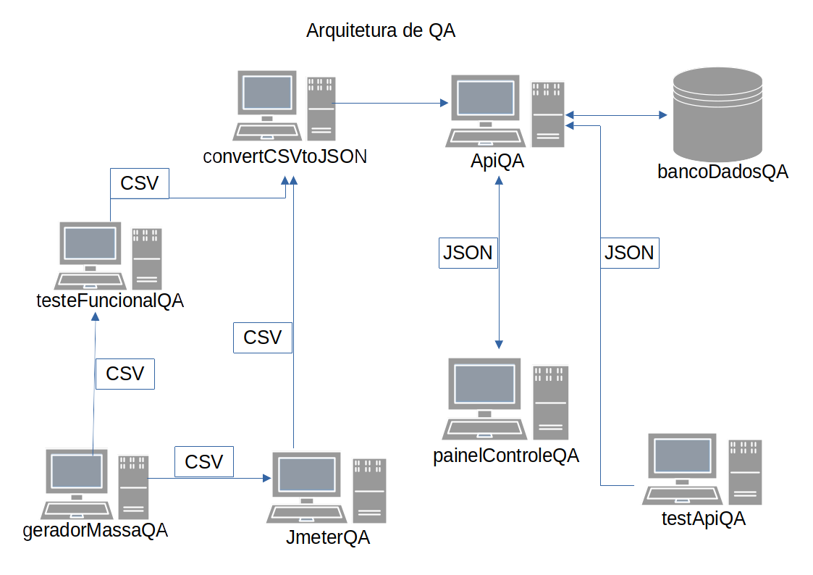

# Test API QA (EM DESENVOLVIMENTO)

> Painel Teste, faz parte de arquitetura de sistema para testa sistemas web. 

> __Mais informacoes sobre a Arquitetura QA__ 

>  Email = marcosregato01@gmail.com 
>  Assunto = Arquitetura QA

> __Descrição do projeto__

>	Valida a estrutura do JSON da requisição via GET 

> __Ferramentas de desenvolvimento__

> * NodeJS
> * Mocha
> * Chai

# Links dos projetos da arquitetura

> __Teste Funcional QA__
> [Link do projeto](https://github.com/marcosregato/funcionalQA). 

> __Painel Teste Angular__
> [GitHub Pages](https://github.com/marcosregato/painelTesteAngular). 

> __Api Teste MongoDB__
> [GitHub Pages](https://github.com/marcosregato/apiTesteMongoDB). 

> __convert CSV to JSON__
> [GitHub Pages](https://github.com/marcosregato/convertCSVtoJSON). 

> __Data Science QA__
> [GitHub Pages](https://github.com/marcosregato/dataScienceQA). 

> __Api QA__
> [GitHub Pages](https://github.com/marcosregato/apiQA). 

> __Test Api QA__
> [GitHub Pages](https://github.com/marcosregato/testApiQA). 

> __Gerador massa de dados QA__
> [GitHub Pages](https://github.com/marcosregato/geradorMassaQA). 
